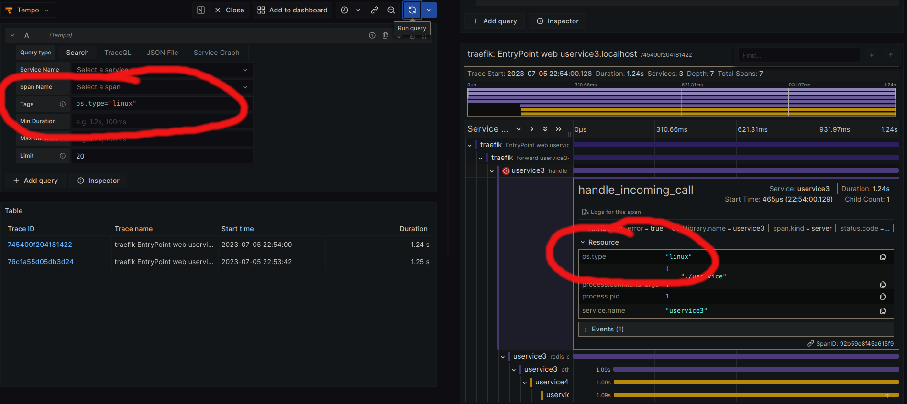
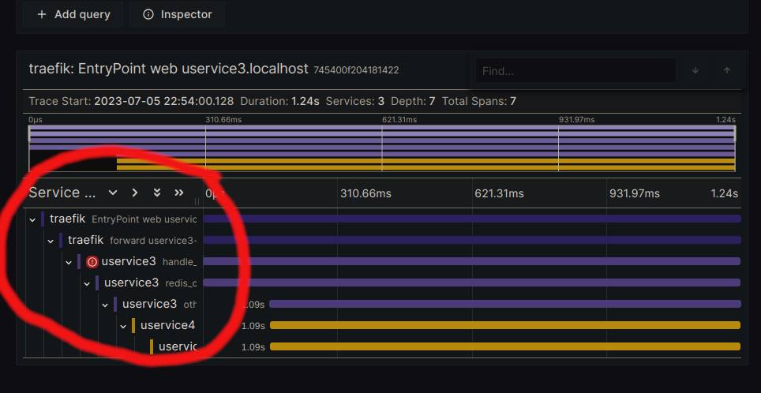
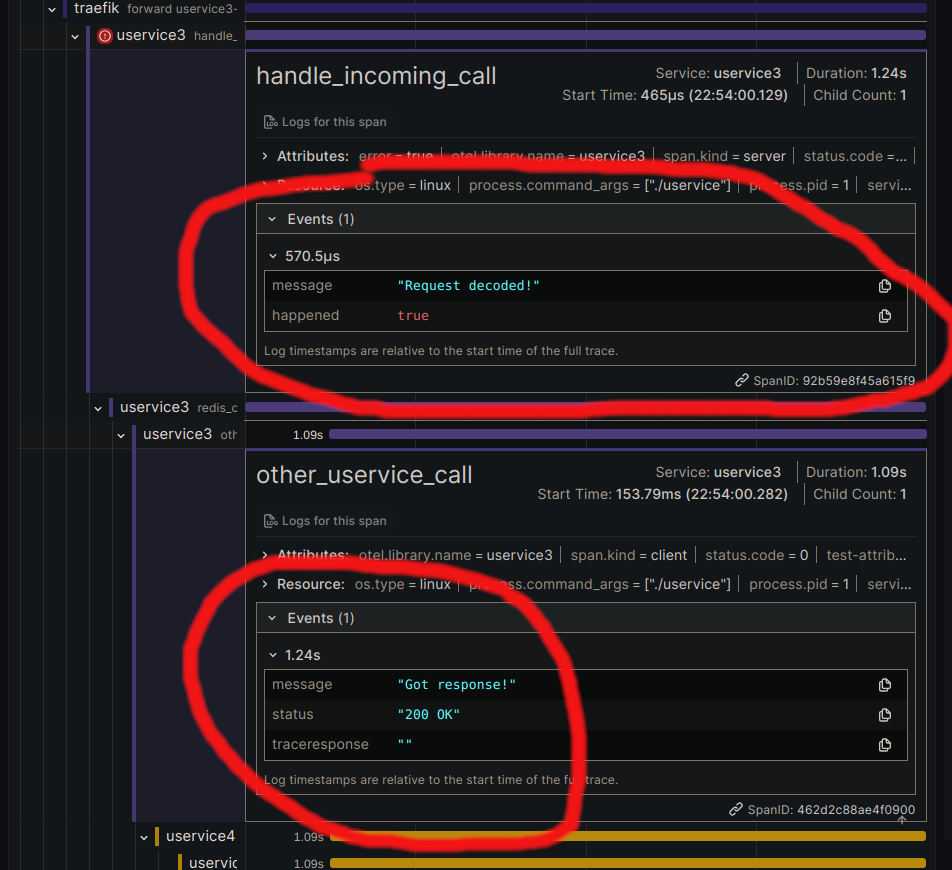
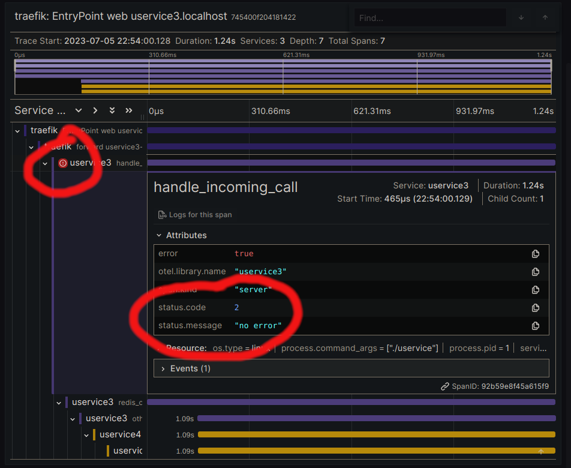

-   [Intro](#intro)
-   [Running the Demo services](#running-the-demo-services)
-   [Quick Demo](#quick-demo)
-   [Commentary](#commentary)
    -   [Infra services configuration
        (Grafana/Prometheus/Tempo/Traefik)](#infra-services-configuration-grafanaprometheustempotraefik)
    -   [microservices](#microservices)
-   [Notes](#notes)
    -   [Link to docker compose
        services](#link-to-docker-compose-services)
    -   [Other](#other)
    -   [A nice webinar from Grafana Getting started with tracing and
        Grafana
        Tempo](#a-nice-webinar-from-grafana-getting-started-with-tracing-and-grafana-tempo)

# Intro

This is a short demo of two instrumeneted Rust toy-microservices,
sending traces to Tempo with the OTLP protocol, and using the Jaeger
propagation format

# Running the Demo services

Make sure all files in the `conf` directory are world readable

``` bash
chmod 0644 ./conf/*
```

Then start all docker containers

``` bash
docker compose up --abort-on-container-exit --build --force-recreate [--timestamps]
```

# Quick Demo

-   You can start by visiting the *un-instrumented* microservice 1 at
    [<http://uservice1.localhost/>](http://uservice1.localhost/) in a
    browser and watch the `docker compose` logs for the call to
    `uservice2`. Before forwarding the HTTP request to microservice 1,
    Traefik adds a `uber-trace-id` header. You can observe this in
    docker compose logs

    ``` example
    grafana-tempo-rust-demo-uservice1-1   | Request: {
    grafana-tempo-rust-demo-uservice1-1   |     "host": "uservice1.localhost",
    grafana-tempo-rust-demo-uservice1-1   |     ...
    grafana-tempo-rust-demo-uservice1-1   |     "uber-trace-id": "5737c004a641f5eb:1f1e2d6167105390:5737c004a641f5eb:1",
    grafana-tempo-rust-demo-uservice1-1   |     ...
    grafana-tempo-rust-demo-uservice1-1   | }
    ```

    You will notice that the request takes anywhere from \~1100
    milliseconds to \~2200 milliseconds. Also, note that the operator,
    without examining log timestamps, has no way of knowing which part
    of the internal flow delayed the response to the caller

-   You can continue by visiting the *instrumented* microservice 3 at
    [<http://uservice3.localhost/>](http://uservice3.localhost/) in a
    browser and watch the `docker compose` logs for the call to
    `uservice4` as well as the `uber-trace-id` headers. You can now
    visit [Grafana -\> Explore -\> Tempo -\>
    Search](http://localhost:3000/explore?orgId=1&left=%7B%22datasource%22:%22tempo%22,%22queries%22:%5B%7B%22refId%22:%22A%22,%22datasource%22:%7B%22type%22:%22tempo%22,%22uid%22:%22tempo%22%7D,%22queryType%22:%22nativeSearch%22,%22limit%22:20%7D%5D,%22range%22:%7B%22from%22:%22now-1h%22,%22to%22:%22now%22%7D%7D)
    and search for the Trace that was generated. You can explore the
    Trace's spans in the right Tempo pane. Note that, by looking at the
    span information you can deduce how long each of the mock calls to
    Redis and the Database took

# Commentary

### Infra services configuration (Grafana/Prometheus/Tempo/Traefik)

These services comprise the infra part of this demo and we won't go into
their detailed configuration in this document, except for a few key
points

-   Tempo has `OTLP` and `Jaeger` listeners configured in
    `conf/tempo.yaml`

    ``` example
    distributor:
      receivers:
        otlp:    # for microservices
          protocols:
            grpc:
        jaeger:  # for Traefik
          protocols:
            thrift_http:
    ```

-   Traefik is configured to generate spans and forward them to Tempo in
    `docker-compose.yaml`

    ``` example
    services:
      ...
      traefik:
        ...
          - "--tracing.jaeger=true"
          - "--tracing.jaeger.collector.endpoint=http://tempo:14268/api/traces?format=jaeger.thrift"
    ```

### microservices

1.  uservice1

    `uservice1` waits for an incoming HTTP request. Upon receipt it
    prints the request details, runs a mock redis command lasting
    100-199 milliseconds and calls `uservice2`. It then prints
    `uservice2`'s response and responds to the caller with the contents
    of `uservice1/hello-world.html`

2.  uservice2

    `uservice2` waits for an incoming HTTP request. Upon receipt it
    prints the request details, does a mock database query lasting
    1000-1999 milliseconds and then responds to the caller with the
    contents of `uservice2/hello-world.html`

3.  uservice3

    `uservice3` 3 is the same as microservice 1 with some example
    instrumentation added

    1.  `main()`

        ``` rust
        opentelemetry::global::set_text_map_propagator(opentelemetry_jaeger::Propagator::default());

        let resources =
            OsResourceDetector.detect(std::time::Duration::from_secs(0))
            .merge(&ProcessResourceDetector.detect(std::time::Duration::from_secs(0)))
            .merge(&Resource::new(vec![opentelemetry::KeyValue::new("service.name", "uservice3")]));

        opentelemetry_otlp::new_pipeline()
            .tracing()
            .with_exporter(opentelemetry_otlp::new_exporter().tonic())
            .with_trace_config(
                opentelemetry::sdk::trace::config()
                    .with_id_generator(opentelemetry::sdk::trace::RandomIdGenerator::default())
                    .with_sampler(opentelemetry::sdk::trace::Sampler::AlwaysOn)
                    .with_resource(resources),
            )
            .install_simple()
            .unwrap();
        ```

        `opentelemetry::global::set_text_map_propagator(opentelemetry_jaeger::Propagator::default())`
        is setting up [Jaeger native propagation
        format](https://www.jaegertracing.io/docs/1.22/client-libraries/#propagation-format).
        This is used later to extract the `uber-trace-id` HTTP header
        from incoming requests and initialize a tracing context

        ``` rust
        let parent_cx = opentelemetry::global::get_text_map_propagator(|propagator| {
            propagator.extract(&HeaderExtractor(req.headers()))
        });
        ```

        and also inject a tracing context via the same HTTP header to
        outgoing requests

        ``` rust
        opentelemetry::global::get_text_map_propagator(|propagator| {
            propagator.inject_context(&cx, &mut HeaderInjector(req.headers_mut().unwrap()))
        });
        ```

        `OsResourceDetector.detect(std::time::Duration::from_secs(0))`
        adds a `os.type=linux` resource to generated spans

        

        Similarly
        `ProcessResourceDetector.detect(std::time::Duration::from_secs(0)))`
        adds `process.command_args` and `process.pid` resources. These
        can be used in the Tempo query to filter traces as shown in the
        screenshot above
        `Resource::new(vec![opentelemetry::KeyValue::new("service.name", "uservice3")])`
        sets the microservice name displayed by Tempo

        

        `opentelemetry_otlp::new_pipeline()` sets up Opentelemetry to
        forward spans via the OTLP protocol to Tempo. Tempo's address is
        determined via the
        `- OTEL_EXPORTER_OTLP_TRACES_ENDPOINT=http://tempo:4317`
        environment variable, defined in `docker-compose.yaml`. There is
        also an `opentelemetry::sdk::export::trace::stdout` example, to
        aid with debugging, that writes spans to stdout instead of
        sending them to Tempo.

        `with_trace_config()` sets some properties of the generated
        spans suitable for this demo, which may or may not be useful in
        a production environment. Specifically,
        `.with_id_generator(opentelemetry::sdk::trace::RandomIdGenerator::default())`
        sets up a random ID generator for the spans, and
        `.with_sampler(opentelemetry::sdk::trace::Sampler::AlwaysOn)`
        ensures that all generated spans are send to Tempo (no
        sampling). Finally, `install_simple()` makes OpenTelemetry ship
        spans to Tempo, one-by-one as generated and should not be used
        in production environments. For production environments,
        `install_batch()` ought to be more appropriate

        Some more options can be found in [Kitchen Sink Full
        Configuration](https://docs.rs/opentelemetry-otlp/latest/opentelemetry_otlp/#kitchen-sink-full-configuration)

    2.  `handle_incoming_call()`

        Incoming requests are handled by
        `async fn handle_incoming_call(req: Request<Body>) -> Result<Response<Body>, Infallible> {`

        ``` rust
        async fn handle_incoming_call(req: Request<Body>) -> Result<Response<Body>, Infallible> {
          let parent_cx = opentelemetry::global::get_text_map_propagator(|propagator| {
              propagator.extract(&HeaderExtractor(req.headers()))
          });

          let tracer = opentelemetry::global::tracer("uservice3");
          let span = tracer
              .span_builder("handle_incoming_call")
              .with_kind(opentelemetry::trace::SpanKind::Server)
              .start_with_context(&tracer, &parent_cx);

          let cx = Context::current_with_span(span);

          println!("Request: {:#?}", req.headers());
        }
        ```

        The code here extracts a context from the incoming HTTP request.
        This is needed so that the new span created here (kind:
        `Server`) is a child span of Traefik's `Client` span
        ([OpenTelemetry -
        SpanKind](https://opentelemetry.io/docs/specs/otel/trace/api/#spankind)
        explains the different kinds of spans). This is what allows
        Tempo to determine that both Traefik's span and `uservice3`'s
        span are part of a single trace and display them nested

        

        Looking at the stdout tracer's output mentioned above, may help
        you understand this more clearly

        ``` example
        grafana-tempo-rust-demo-uservice3-1   | SpanData {
        grafana-tempo-rust-demo-uservice3-1   |     span_context: SpanContext {
        grafana-tempo-rust-demo-uservice3-1   |         trace_id: 0000000000000000771a728620b4bd35,
        grafana-tempo-rust-demo-uservice3-1   |         span_id: 7f8daf512c6da6da,
        grafana-tempo-rust-demo-uservice3-1   |         ...
        grafana-tempo-rust-demo-uservice3-1   |     },
        grafana-tempo-rust-demo-uservice3-1   |     parent_span_id: 36996754408fb4a8,
        grafana-tempo-rust-demo-uservice3-1   |     span_kind: Server,
        grafana-tempo-rust-demo-uservice3-1   |     ...
        grafana-tempo-rust-demo-uservice3-1   | }
        ```

        ``` rust
        cx.span().add_event(
            "Request decoded!",
            vec![opentelemetry::KeyValue::new("happened", true)],
        );
        ```

        `cx.span().add_event()` adds an event within the span

        

        ``` rust
        cx.span()
            .set_status(opentelemetry::trace::Status::error("no error"));
        ```

        `cx.span().set_status()` sets the span's status

        

        ``` rust
        call_redis().with_context(cx).await;
        ```

        Finally, `call_redis()` is called and the current context is
        passed on, so that any new spans will be created as children of
        the current one. More details about this can be found in
        [OpenTelemetry - async active
        spans](https://docs.rs/opentelemetry/latest/opentelemetry/trace/index.html#async-active-spans).
        Upon completion of the `handle_incoming_call` the span is
        `end()~ed
    3.  `call_redis()`

        ``` rust
        async fn call_redis() {
            let tracer = opentelemetry::global::tracer("uservice3");
            let span = tracer
                .span_builder("redis_call")
                .with_kind(opentelemetry::trace::SpanKind::Internal)
                .start(&tracer);

            let cx = Context::current_with_span(span);

            cx.span()
                .set_attribute(KeyValue::new("test-attribute-1", "test-values-1"));

            // mock redis call lasting 100-199 ms
            std::thread::sleep(std::time::Duration::from_millis(
                rand::thread_rng().gen_range(100..199),
            ));

            call_other_uservice().with_context(cx).await;
        }
        ```

        `call_redis()` creates a child span sets an example attribute
        and passes the context to `call_other_uservice()`

        

    4.  `call_other_uservice()`

        `call_other_uservice()` works similarly to the above, with the
        addition that it injects the current context in the HTTP headers
        of the call to `uservice4` with this code

        ``` rust
        opentelemetry::global::get_text_map_propagator(|propagator| {
            propagator.inject_context(&cx, &mut HeaderInjector(req.headers_mut().unwrap()))
        });
        ```

4.  uservice4

    `uservice4` is the same as `uservice2` with some example
    instrumentation added, similarly to `uservice3`

# Notes

### Link to docker compose services

-   [Grafana/Tempo](http://localhost:3000/explore?orgId=1&left=%7B%22datasource%22:%22tempo%22,%22queries%22:%5B%7B%22refId%22:%22A%22,%22datasource%22:%7B%22type%22:%22tempo%22,%22uid%22:%22tempo%22%7D,%22queryType%22:%22nativeSearch%22,%22limit%22:20%7D%5D,%22range%22:%7B%22from%22:%22now-1h%22,%22to%22:%22now%22%7D%7D)
-   [Prometheus](http://localhost:9090/)
-   [Traefik dashboard](http://localhost:8080/dashboard/)

<!-- -->

-   [uservice1 - direct](http://localhost:8081/)
-   [uservice1 - through Traefik](http://uservice1.localhost/)
-   [uservice2 - direct](http://localhost:8082/)
-   [uservice2 - through Traefik](http://uservice2.localhost/)
-   [uservice3 - direct](http://localhost:8083/)
-   [uservice3 - through Traefik](http://uservice3.localhost/)
-   [uservice4 - direct](http://localhost:8084/)
-   [uservice4 - through Traefik](http://uservice4.localhost/)

### Other

-   The implementation above is a minimal implementation, for demo
    purposes only, that is not production-ready

-   [It looks
    like](https://github.com/traefik/traefik/issues/6374#issuecomment-1329393583)
    Traefik will support sending traces to Tempo with the OTLP protocol
    from version 3.0 onwards

-   `docker-compose.yaml` is based on [Official Tempo docker-compose
    'Local Storage'
    example](https://github.com/grafana/tempo/tree/71577bb7d62abe6acb836b92eb2c5a245b4c9d27/example/docker-compose/local)
    and [Traefik docker compose
    example](https://doc.traefik.io/traefik/v2.10/user-guides/docker-compose/basic-example/)

-   `uservice1`, `uservice2`, `uservice3` and `uservice4` are based on
    [The Rust Programming Language (the
    book)](https://doc.rust-lang.org/book/ch20-00-final-project-a-web-server.html)
    and

    -   [OpenTelemetry - Instrumented Server -
        Example](https://github.com/open-telemetry/opentelemetry-rust/blob/67bc4f99a854954976b7dd834a88cbfb517ebe0a/examples/traceresponse/src/server.rs)
    -   [OpenTelemetry - Instrumented Client -
        Example](https://github.com/open-telemetry/opentelemetry-rust/blob/67bc4f99a854954976b7dd834a88cbfb517ebe0a/examples/traceresponse/src/client.rs)

-   To create a `README.md` from `README.org`, you can run

    ``` bash
    pandoc --from org --to gfm --standalone --toc README.org --output README.md
    ```

### A nice webinar from Grafana [Getting started with tracing and Grafana Tempo](https://grafana.com/go/webinar/getting-started-with-tracing-and-grafana-tempo-amer/?pg=oss-tempo&plcmt=featured-videos-1)
